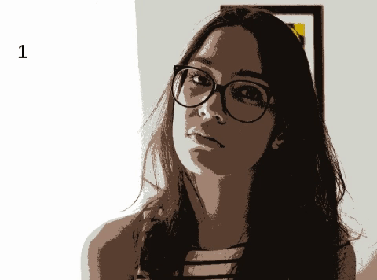

<!--
You can use HTML elements in Markdown, such as the comment element, and they won't be affected by a markdown parser. However, if you create an HTML element in your markdown file, you cannot use markdown syntax within that element's contents.
-->

# Índice
1. [Manipulação de pixels](#pixels)
    1. [Exercício 1 - Inverter cores](#pixels-ex1)
    2. [Exercício 2 - Troca de regiões](#pixels-ex2)
2. [Preenchimento de Regiões](#regioes)
3. [Manipulação de Histogramas](#histogramas)
    1. [Exercício 1 - Equalização de histograma](#histogramas-ex1)
4. [Filtragem no domínio espacial](#espacial1)
    1. [Exercício - Filtro laplaciano do gaussiano](#espacial-ex)
5. [Filtragem no domínio espacial II](#espacial2)
    1. [Exercício 1 - Tiltshift](#espacial2-ex)
6. [DFT](#dft)
    1. [Exercício - Filtro Homomórfico](#dft-ex)
7. [Algoritmo de Canny](#canny)
    1. [Exercício - Pontilhismo](#canny-ex)
8. [Quantização com K-Means](#kmeans)
    1. [Exercício](#kmeans-ex)


## Manipulação de pixels <a name="pixels"></a>
### Exercício 1 - Inverter cores  <a name="pixels-ex1"></a>

Este programa, a partir de dois pontos P1(x,y) e P2(x,y) escolhidos pelo usuário, inverte as cores dos pixels localizados na região entre esses pontos.

#### Código:
```cpp
#include <iostream>
#include <opencv2/opencv.hpp>

using namespace cv;
using namespace std;

int main (int, char**){
  Mat image;
  Vec3b val;
  int p1x, p1y, p2x, p2y;

  image =  imread("img/saladca.png", CV_LOAD_IMAGE_COLOR);

  if(!image.data){
    cout << "imagem não encontrada" << endl;
  } else{
    resize(image, image, Size(960,540));
  }

  namedWindow("janela",WINDOW_AUTOSIZE);

  cout<<"Escolha um ponto P1(x) entre 0 e "<<image.cols<<":" << endl;
  cin>>p1x;
  cout<<"Escolha um ponto P2(x) entre 0 e "<<image.cols<<":" << endl;
  cin>>p2x;

  cout<<"Escolha um ponto P1(y) entre 0 e "<<image.rows<<":" << endl;
  cin>>p1y;
  cout<<"Escolha um ponto P2(y) entre 0 e "<<image.rows<<":" << endl;
  cin>>p2y;

  if(p1x > p2x){
    int aux;
    aux = p1x;
    p1x = p2x;
    p2x = aux;
  }
  if(p1y > p2y){
    int aux;
    aux = p1y;
    p1y = p2y;
    p2y = aux;
  }

  for (int i = p1y; i < p2y; i++){
    for(int j = p1x; j < p2x; j++){
      val = image.at<Vec3b>(i,j);

      val[0] = 255 - val[0];
      val[1] = 255 - val[2];
      val[2] = 255 - val[2];
      image.at<Vec3b>(i,j)= val;
    }
  }


imshow("janela", image);
waitKey();
return 0;
}
```
#### Original:


#### Resultado:


### Exercício 2 - Troca de regiões  <a name="pixels-ex2"></a>

A função deste programa é trocar cada quadrante da imagem pelo seu oposto na diagonal.

#### Código:

```cpp
#include <iostream>
#include <opencv2/opencv.hpp>

using namespace cv;
using namespace std;

int main(int, char**){
  Mat image;
  Vec3b aux;
  image =  imread("img/IMG_0904edit.jpg", CV_LOAD_IMAGE_COLOR);

  if(!image.data){
    cout << "imagem não encontrada" << endl;
  } else{
    resize(image, image, Size(720,480));
  }
  namedWindow("janela",WINDOW_AUTOSIZE);

  for(int i = 0; i < image.rows/2; i++){
    for(int j = 0; j < image.cols/2; j++){
      aux = image.at<Vec3b>(i,j);
      image.at<Vec3b>(i,j) = image.at<Vec3b>(i+image.rows/2,j+image.cols/2);
      image.at<Vec3b>(i+image.rows/2,j+image.cols/2) = aux;

      aux = image.at<Vec3b>(i+image.rows/2,j);
      image.at<Vec3b>(i+image.rows/2,j) = image.at<Vec3b>(i,j+image.cols/2);
      image.at<Vec3b>(i,j+image.cols/2) = aux;

    }
  }


  imshow("janela", image);
  waitKey();
  return 0;
}

```
#### Imagem Original:

#### Resultado:


## Preenchimento de Regiões <a name="regioes"></a>

No primeiro exercício pede-se encontrar uma forma de rotular os elementos caso existam mais de 255 na imagem. A maneira que utilizei foi dividir os objetos em dois tipos: com e sem buraco. Os objetos com buraco possuem uma cor mais escura que os sem buraco.

Inicialmente foi utilizado o floodfill para percorrer as bordas e remover os objetos que estivessem em contato com elas. Depois foi alterada a cor de fundo para um tom de cinza, assim quando o floodfill detectar um objeto que possua a cor preta dentro dele, já o rotula como "com buraco".

### Exercícios 1 e 2

```cpp
#include <iostream>
#include <opencv2/opencv.hpp>

using namespace cv;
using namespace std;

int main(int argc, char** argv){
  Mat image, mask;
  int width, height;
  int comBuraco, semBuraco;

  CvPoint p;
  image = imread("img/bolhas.png",CV_LOAD_IMAGE_GRAYSCALE);

  if(!image.data){
    std::cout << "imagem nao carregou corretamente\n";
    return(-1);
  }
  width=image.size().width;
  height=image.size().height;

  p.x=0;
  p.y=0;

  //remover bordas
  for (int i = 0; i < height; i += height-1){
    for (int j = 0; j < width; j++){
      if(image.at<uchar>(i,j) == 255){
        p.x = j;
        p.y = i;
        floodFill(image, p, 0);
      }
    }
  }

  for (int i = 0; i < height; i ++){
    for (int j = 0; j < width; j+= width-1){
      if(image.at<uchar>(i,j) == 255){
        p.x = j;
        p.y = i;
        floodFill(image, p, 0);
      }
    }
  }

  //alterar cor de fundo
  p.x = 0;
  p.y = 0;
  floodFill(image, p, 50);

  //buscar objetos com buracos presentes
  comBuraco = 0;
  semBuraco = 0;
  for(int i=0; i<height; i++){
    for(int j=0; j<width; j++){
      if(image.at<uchar>(i,j) == 0 && image.at<uchar>(i-1,j-1) == 255){
      comBuraco++;
      p.x=j;
  		p.y=i;
			floodFill(image,p,150);
			p.x=j-1;
      p.y=i-1;
      floodFill(image,p,150);
	  }
	 }
  }

  for(int i=0; i<height; i++){
    for(int j=0; j<width; j++){
      if(image.at<uchar>(i,j) == 255){
      semBuraco++;
      p.x=j;
      p.y=i;
      floodFill(image,p,200);
    }
   }
  }

  cout<<"Com buraco: "<<comBuraco<<endl;
  cout<<"Sem buraco: "<<semBuraco<<endl;
  cout<<"Total: " <<comBuraco+semBuraco<<endl;
  imshow("image", image);
  imwrite("labeling.png", image);
  waitKey();
  return 0;
}

```  
#### Imagem Original:

#### Resultado:


## Manipulação de Histogramas <a name="histogramas"></a>

### Exercício 1 - Equalização de histograma <a name="histogramas-ex1"></a>

No exercício, pede-se para realizar a equalização de histograma de uma imagem capturada pela câmera do computador, porém como uso um desktop e não tenho câmera nele, fiz a atividade usando uma imagem estática.

#### Código

```cpp
int main(int argc, char** argv){
  Mat image, equalized;
  int width, height;
  Mat hist;
  int nbins = 256;
  float range[] = {0, 256};
  const float *histrange = { range };
  bool uniform = true;
  bool acummulate = false;

  image= imread("img/gabi.jpg",CV_LOAD_IMAGE_GRAYSCALE);
  if(!image.data){
    cout << "imagem não encontrada" << endl;
  } else{
    //resize(image, image, Size(720,480));
  }

  width  = image.cols;
  height = image.rows;

  cout << "largura = " << width << endl;
  cout << "altura  = " << height << endl;
  imshow("original", image);

  calcHist(&image, 1, 0, Mat(), hist, 1, &nbins, &histrange, uniform, acummulate);

  equalizeHist(image, equalized);

  imwrite("img/eq.jpg", equalized);
  imshow("equalized", equalized);
  waitKey();

  return 0;
}
```
#### Imagem original

#### Resultado


## Filtragem no domínio espacial I <a name="espacial1"></a>

### Exercício - Filtro laplaciano do gaussiano <a name="espacial-ex"></a>

Neste exercício, foi proposto adicionar uma nova função ao exemplo fornecido no material, que é utilizar o filtro laplaciano do gaussiano. No programa original, utiliza-se a câmera do computador, mas como uso um desktop e não tenho câmera nele, fiz algumas modificações para que o mesmo fucionasse utilizando uma imagem estática.


```cpp
#include <iostream>
#include <opencv2/opencv.hpp>

using namespace cv;
using namespace std;

float media[] = {1,1,1,
                 1,1,1,
                 1,1,1};
float gauss[] = {1,2,1,
                 2,4,2,
                 1,2,1};
float horizontal[]={-1,0,1,
                    -2,0,2,
                    -1,0,1};
float vertical[]={-1,-2,-1,
                  0,0,0,
                  1,2,1};
float laplacian[]={0,-1,0,
                  -1,4,-1,
                   0,-1,0};
float LoG[] = {1,2,1,
               2,-16,2,
               1,2,1};

int absolut;
char key;
Mat image, imagef, result;
Mat mask(3,3,CV_32F), mask1;

void printmask(Mat &m){
  for(int i=0; i<m.size().height; i++){
    for(int j=0; j<m.size().width; j++){
      cout << m.at<float>(i,j) << ",";
    }
    cout << endl;
  }
}

void menu(){
  cout << "\npressione a tecla para ativar o filtro: \n"
	"a - calcular modulo\n"
  "m - media\n"
  "g - gauss\n"
  "v - vertical\n"
	"h - horizontal\n"
  "l - laplaciano\n"
  "p - laplaciano do gaussiano\n"
	"esc - sair\n";
  cin>>key;
  switch(key){
    case 'a':
      absolut=!absolut;
      break;
    case 'm':
      mask = Mat(3, 3, CV_32F, media);
      scaleAdd(mask, 1/9.0, Mat::zeros(3,3,CV_32F), mask1);
      mask = mask1;
      printmask(mask);
      break;
    case 'g':
      mask = Mat(3, 3, CV_32F, gauss);
      scaleAdd(mask, 1/16.0, Mat::zeros(3,3,CV_32F), mask1);
      mask = mask1;
      printmask(mask);
      break;
    case 'h':
      mask = Mat(3, 3, CV_32F, horizontal);
      printmask(mask);
      break;
    case 'v':
      mask = Mat(3, 3, CV_32F, vertical);
      printmask(mask);
      break;
    case 'l':
      mask = Mat(3, 3, CV_32F, laplacian);
      printmask(mask);
      break;
    case 'p':
      mask = Mat(3, 3, CV_32F, LoG);
      printmask(mask);
      break;
    default:
    break;
  }
}

int main(int argvc, char** argv){

  double width, height;

  image = imread("img/gabi.jpg", CV_LOAD_IMAGE_GRAYSCALE);
  image.copyTo(imagef);
  width=image.cols;
  height=image.rows;
  std::cout << "largura=" << width << "\n";;
  std::cout << "altura =" << height<< "\n";;

  namedWindow("filtroespacial",1);

  mask = Mat(3, 3, CV_32F, media);
  scaleAdd(mask, 1/9.0, Mat::zeros(3,3,CV_32F), mask1);
  swap(mask, mask1);
  absolut=0; // calcs abs of the image

  menu();

  imshow("original", image);
  filter2D(image, imagef, image.depth(), mask, Point(1,1), 0);
  if(absolut){
    imagef=abs(imagef);
  }
  imagef.convertTo(result, CV_8U);
  imshow("filtroespacial", result);  
  key = (char) waitKey(10);

  waitKey(0);
  return 0;
}

```
#### Resultado


## Filtragem no domínio espacial II <a name="espacial2"></a>

### Exercício 1 - Tiltshift <a name="espacial2-ex"></a>
Este programa reproduz o efeito "tiltshift" em uma imagem.

Uma máscara de borramento é aplicada em uma cópia da imagem original e o usuário do programa escolhe onde as seções borradas serão exibidas. Logo após a execução do programa, a nova imagem é salva em um arquivo.


#### Código

```cpp
#include <iostream>
#include <opencv2/opencv.hpp>
#include <cmath>

using namespace cv;
using namespace std;

double alfa;

int sup_slider = 0;
int sup_slider_max;

int decay_slider = 0;
int decay_slider_max = 100;

int inf_slider = 0;
int inf_slider_max;

Mat image1, image2, blended;

char TrackbarName[50];

double alpha(double x, double l1, double l2, double d){
  return 0.5*(tanh((x-l1)/d) - tanh((x-l2)/d));
}

void on_trackbar_blend(int,void*){
 for (int i = 0; i< image1.rows; i++){
   alfa = alpha(i, sup_slider, inf_slider, decay_slider);
    addWeighted( image1.row(i), alfa, image2.row(i), 1-alfa, 0.0, blended.row(i));
 }
 imshow("tiltshift", blended);
 imwrite("filtrada.jpg", blended);
}


int main(int argvc, char** argv){
  image1 = imread("img/gabi.jpg");
  image1.copyTo(image2);
  image1.copyTo(blended);
  namedWindow("tiltshift", 1);

  sup_slider_max = image1.rows;
  inf_slider_max = image1.rows;

  float media[] = {1,1,1,
                   1,1,1,
                   1,1,1};
  Mat mask(3,3,CV_32F), mask1;
  mask = Mat(3, 3, CV_32F, media);
  scaleAdd(mask, 1/9.0, Mat::zeros(3,3,CV_32F), mask1);
  mask = mask1;

  for(int i = 0; i< 20; i++){
    filter2D(image1, image2, image1.depth(), mask, Point(1,1), 0);
  }
  sprintf( TrackbarName, "Superior %d", sup_slider_max );
  createTrackbar( TrackbarName, "tiltshift",
				  &sup_slider,
				  sup_slider_max,
				  on_trackbar_blend );
  on_trackbar_blend(sup_slider, 0 );

  sprintf( TrackbarName, "Decaimento %d", decay_slider_max );
  createTrackbar( TrackbarName, "tiltshift",
				  &decay_slider,
				  decay_slider_max,
				  on_trackbar_blend );
  on_trackbar_blend(decay_slider, 0 );

  sprintf( TrackbarName, "Inferior %d", inf_slider_max );
  createTrackbar( TrackbarName, "tiltshift",
          &inf_slider,
          inf_slider_max,
          on_trackbar_blend );
  on_trackbar_blend(inf_slider, 0 );

  waitKey(0);
  return 0;
}

```
#### Resultado


## DFT <a name="dft"></a>

### Exercício - Filtro Homomórfico <a name="dft-ex"></a>

## Algoritmo de Canny <a name="canny"></a>

### Exercício - Pontilhismo <a name="canny-ex"></a>
#### Código
```cpp
#include <iostream>
#include <opencv2/opencv.hpp>
#include "opencv2/imgproc/imgproc.hpp"
#include <fstream>
#include <iomanip>
#include <vector>
#include <algorithm>
#include <numeric>
#include <ctime>
#include <cstdlib>

using namespace std;
using namespace cv;

#define STEP 5
#define JITTER 3
#define RAIO 3

int main(int argc, char** argv){
  vector<int> yrange;
  vector<int> xrange;

  Mat image, frame, points;

  int width, height, gray;
  int x, y;

  image= imread("img/gabi.jpg",CV_LOAD_IMAGE_GRAYSCALE);

  srand(time(0));

  width  = image.cols;
  height = image.rows;

  xrange.resize(height/STEP);
  yrange.resize(width/STEP);

  iota(xrange.begin(), xrange.end(), 0);
  iota(yrange.begin(), yrange.end(), 0);

  for(uint i=0; i<xrange.size(); i++){
    xrange[i]= xrange[i]*STEP+STEP/2;
  }

  for(uint i=0; i<yrange.size(); i++){
    yrange[i]= yrange[i]*STEP+STEP/2;
  }

  points = Mat(height, width, CV_8U, Scalar(255));

  random_shuffle(xrange.begin(), xrange.end());

  for(auto i : xrange){
    random_shuffle(yrange.begin(), yrange.end());
    for(auto j : yrange){
      x = i+rand()%(2*JITTER)-JITTER+1;
      y = j+rand()%(2*JITTER)-JITTER+1;
      gray = image.at<uchar>(x,y);
      circle(points,
             cv::Point(y,x),
             RAIO,
             CV_RGB(gray,gray,gray),
             -1,
             CV_AA);
    }
  }
  imwrite("gabi-points.jpg", points);

  /**
  Início do algoritmo de Canny
  **/
  int execs = 5;

  for (int i = 0; i < execs; i++){
    Mat blur, border;
    int threshold = 5;
    int ratio = 5;
    int kernel_size = 5;
    Canny(image, border, threshold, ratio*threshold, kernel_size);
    for (int j = 0; j< height; j++){
      for(int k = 0; k < width; k++){
        if(border.at<uchar>(j,k)>0){
                gray = image.at<uchar>(j,k);
                circle(points, Point(k,j),RAIO,CV_RGB(gray,gray,gray),-1,CV_AA);
                }
      }
    }
  }

  imwrite("gabi-canny-points.jpg", points);


  return 0;
}

```
#### Imagem original

#### Resultados


## Quantização com K-Means <a name="kmeans"></a>

### Exercício <a name="kmeans-ex"></a>
#### Código
```cpp
#include <opencv2/opencv.hpp>
#include <cstdlib>

using namespace cv;
using namespace std;

int main( int argc, char** argv ){
  int nClusters = 6;
  Mat rotulos;
  int nRodadas = 1;
  Mat centros;

  Mat img = imread( "img/gabi.jpg", CV_LOAD_IMAGE_COLOR);
  Mat samples(img.rows * img.cols, 3, CV_32F);
  for( int y = 0; y < img.rows; y++ ){
    for( int x = 0; x < img.cols; x++ ){
      for( int z = 0; z < 3; z++){
        samples.at<float>(y + x*img.rows, z) = img.at<Vec3b>(y,x)[z];
	  }
	 }
  }
  kmeans(samples,
		 nClusters,
		 rotulos,
		 TermCriteria(CV_TERMCRIT_ITER|CV_TERMCRIT_EPS, 10000, 0.0001),
		 nRodadas,
		 KMEANS_RANDOM_CENTERS,
		 centros );

  Mat rotulada( img.size(), img.type() );
  for( int y = 0; y < img.rows; y++ ){
    for( int x = 0; x < img.cols; x++ ){
	  int indice = rotulos.at<int>(y + x*img.rows,0);
	  rotulada.at<Vec3b>(y,x)[0] = (uchar) centros.at<float>(indice, 0);
	  rotulada.at<Vec3b>(y,x)[1] = (uchar) centros.at<float>(indice, 1);
	  rotulada.at<Vec3b>(y,x)[2] = (uchar) centros.at<float>(indice, 2);
	 }
  }
  imshow( "clustered image", rotulada );
  imwrite("img/clustered.jpg", rotulada);
  waitKey( 0 );
}

```

Não há muita diferença entre as imagens pois é realizada apenas 1 rodada. Porém, como os centros são iniciados de forma aleatória, podem convergir de forma diferente em cada execução.

#### Original:

#### Alteradas:

